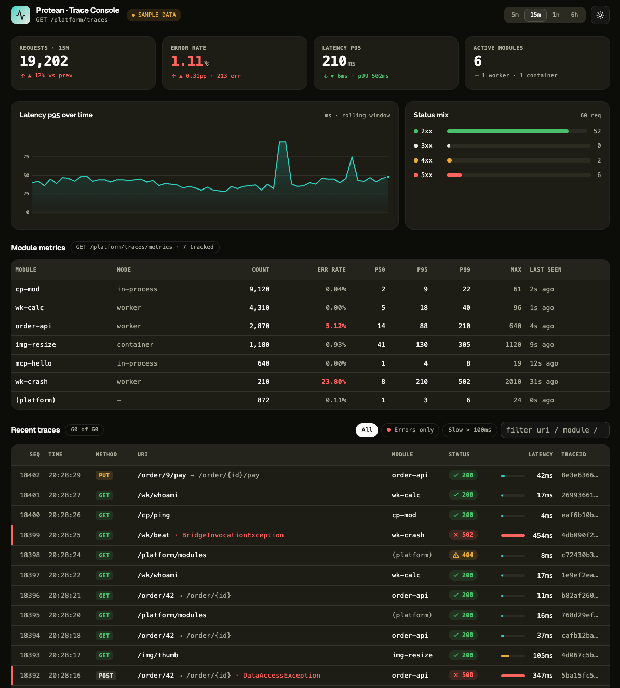

# Protean Console

> Standalone, read-only **runtime-trace observability console** for the
> [Protean](#reference) dynamic-module platform.


A single-page app that consumes the control-plane REST of any Protean-enabled
Spring application and renders its request traces and per-module metrics. It is
**not coupled to any one backend** and ships nothing server-side — it talks to the
platform with plain `fetch` through the Vite dev proxy.

## Table of Contents

- [Context](#context)
- [Features](#features)
- [Screens](#screens)
- [Quick Start](#quick-start)
- [Installation](#installation)
- [Configuration](#configuration)
- [Architecture](#architecture)
- [Platform API surface](#platform-api-surface)
- [Scripts](#scripts)
- [Dependencies](#dependencies)
- [Authentication](#authentication)
- [Roadmap](#roadmap)
- [Reference](#reference)
- [License](#license)

## Context

Protean is a dynamic-module platform for Spring apps: consumers deploy, hot-swap,
and isolate modules at runtime. Every request that flows through a module is
captured as a `RequestTrace`, and per-module counters roll up into a
`ModuleMetricsSnapshot`. Protean exposes these over a **read-only control-plane
REST surface** (`/platform/traces`, `/platform/traces/metrics`, `/platform/modules`).

This console is the operator-facing view of that surface. It is intentionally
thin: one data layer that mirrors the platform's Java records, and a dashboard
that maps 1:1 to them. Because it is decoupled, the same build points at any
Protean-enabled app just by changing the dev proxy target.

`traceId` is the correlation id shared across the trace table, application logs,
and RFC 9457 error bodies — so a trace in this console is the same id you grep for
in logs.

## Features

- **Live / sample auto-fallback** — when a platform is reachable, data is `live`;
  when none is running, the console falls back to grounded mock data so the UI is
  always explorable. The top bar shows a **LIVE** vs **SAMPLE DATA** badge.
- **Polling refresh** — the snapshot re-fetches every 5s, and immediately whenever
  the query (e.g. time range) changes.
- **KPI row** — headline counters (request volume, error rate, latency) for the
  selected window.
- **p95 latency chart** — single-hue telemetry series, bucketed per minute.
- **Status mix** — distribution of request outcomes at a glance.
- **Module metrics table** — per-module counters joined with live module status
  (isolation mode, trust tier) from `/platform/modules`.
- **Recent traces table** — columns map 1:1 to `RequestTrace`; click a `traceId`
  to copy it.
- **Time-range selector** — 5m / 15m / 1h / 6h, each with a sensible row limit.
- **Light / dark theme** — persisted toggle.
- **Accessible status color** — ok/warn/crit is always paired with an icon/label,
  never color alone; charts stay single-hue (no red/green categorical).

## Screens

The dashboard is a single scrollable view: top bar → KPI row → latency chart +
status mix → module metrics table → recent traces table. On first load (or while a
fetch is in flight) it renders skeletons rather than an empty screen.



_Shown with **SAMPLE DATA** (no live platform); the top-bar badge flips to **LIVE**
when a Protean app is reachable._

## Quick Start

```bash
# 1. install deps
npm install

# 2. point the dev proxy at your Protean app (optional — defaults to :8080)
cp .env.example .env        # then edit VITE_PROTEAN_TARGET

# 3. run the dev server
npm run dev
```

Open the printed URL (default `http://localhost:5173`). With no platform running
you'll see **SAMPLE DATA**; start a Protean app on the target host and it switches
to **LIVE** on the next poll.

## Installation

### Prerequisites

- **Node.js ≥ 20.19** (developed on v26). Vite 8 requires a modern Node LTS.
- **npm** (lockfile committed). Any npm-compatible client works, but `npm ci`
  reproduces the committed `package-lock.json` exactly.

### Steps

```bash
git clone git@github.com:htcom-code/protean-console.git
cd protean-console
npm ci            # or: npm install
npm run dev
```

## Configuration

Configuration is via Vite env vars (`.env`, gitignored — see `.env.example`):

| Variable | Default | Purpose |
|---|---|---|
| `VITE_PROTEAN_TARGET` | `http://localhost:8080` | Target Protean-enabled Spring app. The dev proxy forwards `/platform/*` to this host. |

The proxy (in `vite.config.ts`) means the browser only ever talks to the Vite dev
server on the same origin — no CORS setup needed against the platform.

## Architecture

```
src/
├── main.tsx                 # entry
├── App.tsx                  # dashboard layout + query/time-range state
├── components/              # presentational; take plain props
│   ├── top-bar.tsx          # LIVE/SAMPLE badge, range selector, theme toggle
│   ├── kpi-row.tsx
│   ├── latency-chart.tsx    # single-hue p95 series
│   ├── status-mix.tsx
│   ├── module-table.tsx     # metrics ⋈ module status
│   ├── trace-table.tsx      # RequestTrace rows, click-to-copy traceId
│   └── status-pill.tsx      # icon + label + status color
├── hooks/
│   ├── use-console-data.ts  # loadSnapshot + 5s polling
│   └── use-theme.ts
└── lib/
    ├── api.ts               # THE ONLY place that knows HTTP (loadSnapshot/getJson)
    ├── types.ts             # mirror of the Java records — keep in sync
    ├── mock.ts              # grounded fallback data (live: false)
    ├── format.ts            # number/latency formatting (tabular-nums)
    └── utils.ts
```

**Key conventions**

- The **data layer is the only place that knows about HTTP** (`src/lib/api.ts`).
  Components take plain props; state lives in `App.tsx` and the hooks.
- `src/lib/types.ts` mirrors the Java records `RequestTrace` /
  `ModuleMetricsSnapshot` — **keep them in sync** with the backend.
- **Styling**: Tailwind v4 with shadcn (`base-nova` / `olive`) on `@base-ui/react`
  (not radix). Status and telemetry hues are extra tokens in `src/index.css`
  (`--ok/--warn/--crit/--telemetry`), exposed via `@theme inline`.
- Numeric/telemetry text is monospace + `tabular-nums`.

## Platform API surface

`loadSnapshot()` fans out three read-only calls in parallel:

| Endpoint | Maps to | Notes |
|---|---|---|
| `GET /platform/traces` | `RequestTrace[]` | Supports query params below. |
| `GET /platform/traces/metrics` | `ModuleMetricsSnapshot[]` | Opt-in via `protean.trace.metrics.enabled`. |
| `GET /platform/modules` | `ModuleStatus[]` | Joined into the module table for isolation mode / trust tier. |

Trace query params (sent by `api.ts`): `limit`, `moduleId`, `errorsOnly`,
`status`, `minLatencyMs`, `since`, `beforeSeq`.

## Scripts

| Script | Command | Description |
|---|---|---|
| `npm run dev` | `vite` | Dev server with the `/platform` proxy. |
| `npm run build` | `tsc -b && vite build` | Type-check then production build. |
| `npm run preview` | `vite preview` | Serve the production build locally. |
| `npm run lint` | `oxlint` | Lint with oxlint. |

## Dependencies

**Runtime**

- `react` / `react-dom` 19
- `@base-ui/react` — headless primitives (base, not radix)
- `shadcn` / `@shadcn/react` — component style layer (`base-nova` / `olive`)
- `tailwindcss` 4 + `@tailwindcss/vite`, `tw-animate-css`
- `class-variance-authority`, `clsx`, `tailwind-merge` — class composition
- `lucide-react` — icons
- `@fontsource-variable/geist` (sans) + `@fontsource-variable/raleway` (heading)

**Dev / build**

- `vite` 8 + `@vitejs/plugin-react`
- `typescript` 6
- `oxlint`
- `@types/*`

## Authentication

Protean does not impose auth on `/platform/**` by default — it delegates to the
consuming app (typically Spring Security). The console's only job is to attach a
credential to its outbound requests, at a **single choke point** (`getJson` in
`src/lib/api.ts`). This is designed but **not yet implemented**; the scheme
(Bearer / API key / OAuth2) is open. See [`docs/auth-path.md`](docs/auth-path.md).

## Roadmap

- **Auth** — pick a scheme and implement the header provider + 401/403 surface
  (design in `docs/auth-path.md`).
- **Server-side filtering** — `errorsOnly` / `status` / `minLatencyMs` are already
  sent as query params, but the recent-traces table still filters client-side too.
- **i18n / analytics** — not set up (internal MVP).

## Reference

- **Protean platform** — backend dynamic-module platform (`org.htcom:protean`)
  this console observes.
- [Base UI](https://base-ui.com/) — headless component primitives.
- [shadcn](https://ui.shadcn.com/) — component style layer.
- [Tailwind CSS v4](https://tailwindcss.com/) · [Vite](https://vite.dev/) ·
  [React](https://react.dev/) · [oxlint](https://oxc.rs/).
- [RFC 9457](https://www.rfc-editor.org/rfc/rfc9457) — Problem Details error bodies
  (the `traceId` correlation shared with the trace table).

## License

[MIT](LICENSE) © 2026 htcom-code.
